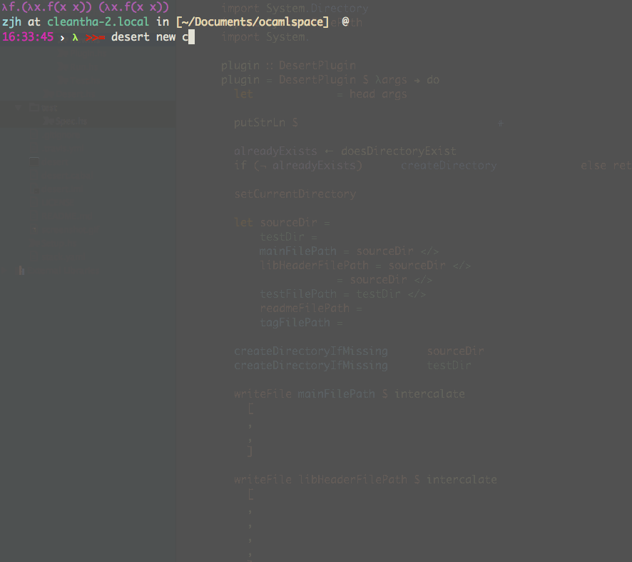

# desert

[](https://travis-ci.org/zjhmale/desert)

## Acknowledgement

well, this project aims to make development with OCaml project painless. But it is still in early stage, so currently it just for self usage.

## Usage

```
desert new xxx # create a new project
desert # build the project
desert run
desert test
desert clean
```

## Screenshot



## License

Copyright © 2016 zjhmale

Distributed under the [](https://en.wikipedia.org/wiki/BSD_licenses)
